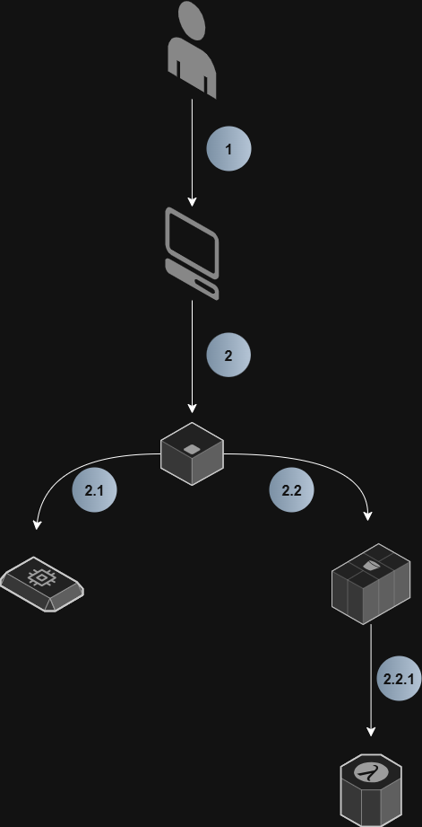

# gerenciamento-instancias-ec2-aws

Desafio proposto: Montar no Draw.io uma arquitetura simples com: EC2 - EBS - S3 - Lambda Function.

Resposta:

Legenda das imagens:

Como funcionaria essa arquitetura (EC2 + EBS + S3 + Lambda):

1 - Usuário acessa o site
- Existe uma instância EC2 rodando no meu site dominio.com.
* Nesse exemplo, estou utilizando o WordPress.
- O usuário entra no navegador > digita o domínio > esse tráfego chega até a minha EC2.

2 - EC2
- Dentro da EC2, o servidor web Apache responde.

2.1 - EBS
- Minha EC2 tem um disco EBS anexado, que funciona como o HD/SSD dela.
- No EBS, armazeno volumes necessários e que trabalham em conjunto com a máquina, como:
- Arquivos de configuração do site.
- Banco de dados.
- Logs.

2.2 - S3
- Digamos que o usuário faça upload de uma foto de um documento.
- Em vez de armazenar no EBS, o sistema manda essa foto pro S3.
- Assim, o usuário consegue realizar o upload de milhões de fotos sem que eu me preocupe recorrentemente com espaço.

2.2.1 - Função Lambda 
- Sempre que chega uma nova imagem, o S3 chama uma Lambda Function.
- Tendo as seguintes principais funções:
- Redimensionar a imagem.
- Gerar miniaturas.
- Validar se o formato é permitido.

Nesse contexto, como tudo se conecta:
- Larissa acessa o site no navegador.
- Esse site está rodando em uma EC2.
- A EC2 usa o EBS para guardar seus arquivos de sistema e configs.
- Larissa envia uma foto > o site joga no S3.
- O S3 dispara um evento > ativa uma Lambda.
- A Lambda processa a foto.

De forma técnica:
EC2 - Instância que roda meu site.
EBS - HD dessa instância.
S3 - Ambiente gigante para guardar arquivos, como um Google Drive.
Lambda - Processa funções.
